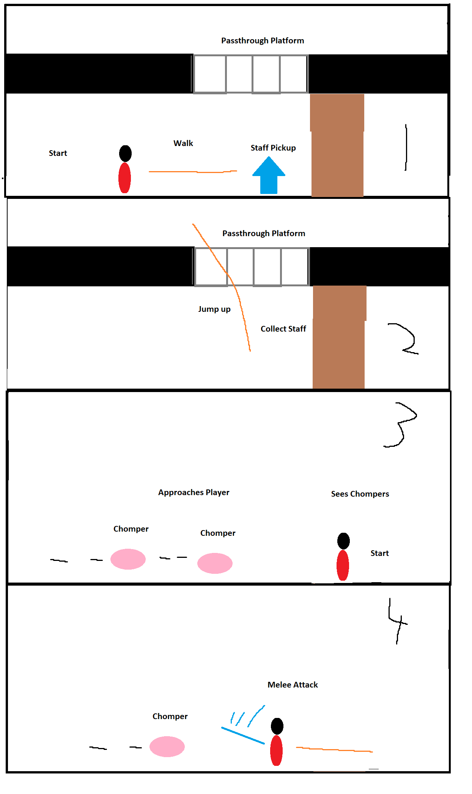
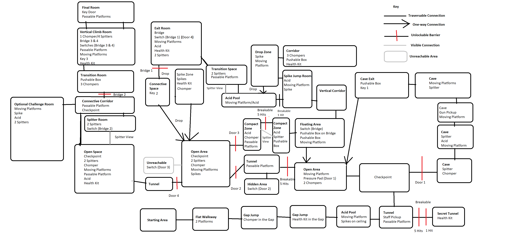

# COMP2150  - Level Design Document
### Name: Jaktar Degun
### Student number: 47397063 

This document discusses and reflects on the design of your platformer level for the Level Design assessment. It should be 1500 words. Make sure you delete this and all other instructional text throughout the document before checking your word count prior to submission.

Your document must include images. To insert an image into your documentation, place it in the "DocImages" folder in this repo, then place the below text where you want the image to appear:

Example:

## 1. Player Experience (~700 words)
Outline and justify how your level design facilitates the core player experience goals outlined in the assignment spec. Each section should be supported by specific examples and screenshots of your game encounters that highlight design choices made to facilitate that particular experience.

### 1.1. Discovery
What does the player learn? How does your encounter and broader level design facilitate learning in a way that follows good design practice?

Within the beginning of the first section. The player learns about how high and far their jump ability can take them. As demonstrated with their encounter with their first chomper. An encounter where they can see they can't cross the gap entirely and are able to dodge over the chomper. The player also learns about the two environmental hazards of the level just after they cross a checkpoint allowing practice to avoid them. By allowing the player to "learn by play". They can see the immediate consequences in their environmental interaction. Thus giving the player a sense of agency over their character. Further in the level. The Staff and Gun are eventually picked up allowing players more solutions and interactions with their environment such as melee attacks on chompers and destructible objects. Along with Ranged attacks shooting the introduced Spitter enemy and switches that open pathways. Lastly, moving platforms are introduced alot especially the end of the first section. This is important for the player to as moving platforms are especially used more further in the level. So introducing many core elements of the level early gives the player what to expect later in the level. 

### 1.2. Drama
What is the intensity curve? How does your design facilitate increasing yet modulating intensity, with moments of tension and relief? 

The intensity curve is the idea where the difficulty of a game or level becomes more intense as the player progress further into the level. Difficulty increases become most notable at section 2. Section 2 is where pressure on the player's position starts to become touched on. This is seen with Spitters used to punish the player standing still or being too slow in certain areas with the Spit projectiles. Encouraging the player give more action than inaction. A notable step in intensity is the compact area involving a destructible wall and a Spitter. The area starts difficult with a careful first jump needed to avoid the acid then jumping up while avoiding jumping into the chomper at the top. After dealing with the chomper, the player than must break the wall with five melee attacks and push a box to open a pathway deeper into the level. Meanwhile the Spitter is in range and spits projectiles toward the player until the player pushes the box entirely. This will seem like an awkward area for the player. This is then transitioned into a calmer area such as a connective space that calmly takes the player into the next encounter. (199)

### 1.3. Challenge
What are the main challenges? How have you designed and balanced these challenges to control the difficulty curve and keep the player in the flow channel?

The main challenges of the level revolves around platforming while dodging many of the level's hazards arranged in unique ways. Sections 2 and 3 are designed around an increasing rise in difficulty before calming down briefly around the sections halfway point. Before than rising again in the levels final area challenging the player's abilities to cross the final hurdle. This can be seen in Section 3. Near the end of the first half is an area where Spitters shoot from an unreachable area making the player move from their spot and encouraging them the finish that area. After completing the first half. The player is given a connective and relatively easy area before they encounter the final area of the game. They are also given an optional challenge area that rewards them a health kit if they so dare. This gives the player a chance to further test their platforming skills before the final area. In which keeps the player focused. 

### 1.4. Exploration
How does your level design facilitate autonomy and invite the player to explore? How do your aesthetic and layout choices create distinct and memorable spaces and/or places?

The level mostly uses background tiles to make certain areas distinct such as hazards visually being clearer. Secret areas hinted and sometimes directions to certain locations. Examples of optional areas include the first destructible wall after the player picks up the staff. Jumping up into the open area is the obvious next move. But the player can see that their is a path beyond the wall, where the player is then rewarded with a health kit. This discovered hidden area further encourages the player to explore more. Another use of further autonomy is at the spike jump room. After the push box puzzle is solved, the player can break a destructible column opening up a shortcut for the player to use. This gives the player a sense of agency as they discovered an alternative route. Aesthetically, background tiles also indicate distinct spaces to go towards such as the final key highlighted by the background tiles as the last step towards the end of the level.

## 2. Core Gameplay (~400 words)
### 2.1. Chompers
Chompers are introduced almost immediately at the beginning where the player has to fall into a gap with the Chomper. This gives the player freedom to understand the mechanics of the Chomper through learning by play.

### 2.2. Health Pickups
Health Pickups are deliberately introduced after the player goes through an encounter such as the Chomper. For Example after the chomper and moving platform encounter the player may have taken damage and will find Health pickups afterward. 

### 2.3. Checkpoints
The first checkpoint is introduced just before the Acid pool room, where the player has made significant enough progress that repeating previous encounters will be considered a waste of the players time, along with being placed before a new challenge.

### 2.4. Moving Platforms
Moving Platforms were introduced in the Acid room. The player is encouraged to wait for the platform to come close towards themselves allowing them to reach the other end of the room.

### 2.5. Acid
Acid is presented as a clear and unpleasant environment hazard as falling in it causes the player to respawn back to their next checkpoint. Its first avoided through platforming across the moving platforms

### 2.6. Spikes
Spikes are introduced as another hazard, but used to restrict certain player behaviours at certain times. Such as the acid room the player cannot use a full button press jump to finish the Acid Room.

### 2.7. Weapon Pickup (Staff)
Upon pickup, the player is given the ability to melee attack. An opportunity for the player to attack is first seen in the first open area where two chompers are presented towards the player.

### 2.8. Passthrough Platforms
Passthrough platforms are first shown as a platform the player can pass through into the open area. Its introduced again near the second trigger door that the player can pass through them from the top. 

### 2.9. Spitters
Spitters are introduced distant from the player as much as possible in order to show how the spitter shoots. Its second introduction is near a moving platform which causes the player to dodge the spitters projectiles which demonstrates the Spitter's full potential and usage throughout the level.

### 2.10. Weapon Pickup (Gun)
The ability to shoot causes two different interacts for the player to use. Firstly the ability to shoot enemies as the player is introduced to a Spitter that the player can shoot and later on a switch that can be activated.

### 2.11. Keys
Keys are presented at the end of an encounter. Used as a tool to reward the player progressing through an encounter where the Keys UI update tells the player they need 2 more to beat the level.

## 3. Spatiotemporal Design
### 3.1. Molecule Diagram

### 3.2. Level Map – Section 1

### 3.3.	Level Map – Section 2

### 3.4.	Level Map – Section 3

## 4. Iterative Design (~400 words)
Reflect on how iterative design helped to improve your level. Additional prototypes and design artefacts should be included to demonstrate that you followed an iterative design process (e.g. pictures of paper prototypes, early grey-boxed maps, additional storyboards of later gameplay sequences, etc.). You can also use this section to justify design changes made in Unity after you drew your level design maps shown in section 3. 

You should conclude by highlighting a specific example of an encounter, or another aspect of your level design, that could be improved through further iterative design.